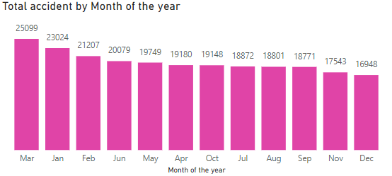

# Nyc-Collisions

# INTRODUCTION
This project aims to provide an in-depth analysis of traffic collision data in New York City, using advanced data visualization techniques in Power BI. By exploring accident patterns across various dimensions such as month, day of the week, time of day, and location, this analysis seeks to uncover key trends that can inform safety measures and help reduce traffic-related incidents.
The dataset used in this analysis includes detailed information on the frequency of accidents, contributing factors, and accident severity (injuries and fatalities). The goal is to identify patterns that can be leveraged to make data-driven decisions, improve road safety, and guide targeted interventions by policymakers and city planners.
This document will outline the methodology used to process and analyze the data, present the key findings, and provide actionable recommendations based on the insights derived from the analysis. 
By providing a clear understanding of when, where, and why accidents occur most frequently, this analysis offers valuable insights for both public safety efforts and traffic management strategies in New York City.

##PROBLEM STATEMENT
1.	Compare the % of total accidents by month. Do you notice any seasonal patterns?
2.	 Break down accident frequency by day of week and hour of day. Based on this data, when do accidents occur most frequently? 
3.	 On which particular street were the most accidents reported? What does that represent as a % of all reported accidents? 
4.	 What was the most common contributing factor for the accidents reported in this sample (based on Vehicle 1)? What about fatal accidents specifically?

##DATA MODEL

##ANALYSIS
Here are the answers to the problem statement are the analysis done:
1. Comparison of Total Accidents by Month and Seasonal Patterns
Based on the analysis of accident data across different months, the following trends were observed:
•	Top 5 months with the highest accident counts:
o	March: 25,099 accidents
o	January: 23,024 accidents
o	February: 21,207 accidents
o	June: 20,079 accidents
o	May: 19,749 accidents
In terms of seasonal breakdown:
•	Spring (March, April, May) exhibited the highest accident frequency, accounting for 26.86% of all reported accidents.
•	Winter (December, January, February) followed with 25.66% of the total accidents.
•	Summer (June, July, August) contributed 24.22%, while Fall (September, October, November) represented 23.26% of the total incidents.
This data suggests that spring, particularly March, sees a peak in accidents, which could be attributed to factors like weather transitions, increased travel activity, or other seasonal variables.

