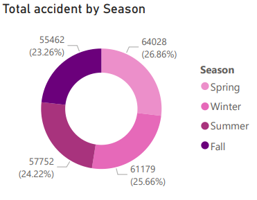
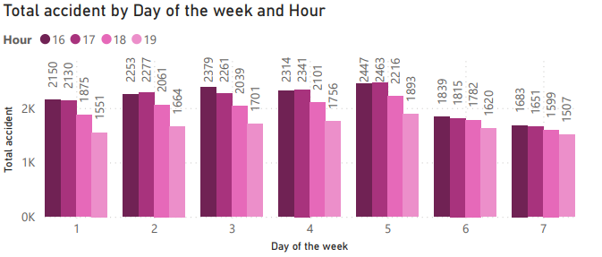
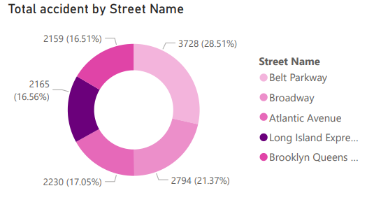
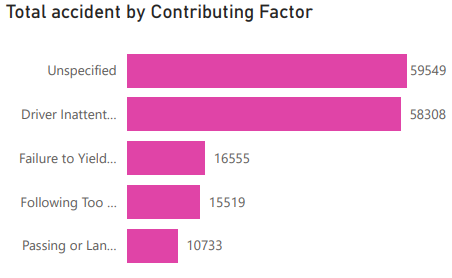

# Nyc-Collisions

# Introduction
This project aims to provide an in-depth analysis of traffic collision data in **New York City**, using advanced data visualization techniques in Power BI. By exploring accident patterns across various dimensions such as month, day of the week, time of day, and location, this analysis seeks to uncover key trends that can inform safety measures and help reduce traffic-related incidents.
The dataset used in this analysis includes detailed information on the frequency of accidents, contributing factors, and accident severity (injuries and fatalities). The goal is to identify patterns that can be leveraged to make data-driven decisions, improve road safety, and guide targeted interventions by policymakers and city planners.
This document will outline the methodology used to process and analyze the data, present the key findings, and provide actionable recommendations based on the insights derived from the analysis. 
By providing a clear understanding of when, where, and why accidents occur most frequently, this analysis offers valuable insights for both public safety efforts and traffic management strategies in New York City.

# Problem statement

1.	Compare the % of total accidents by month. Do you notice any seasonal patterns?
2.	 Break down accident frequency by day of week and hour of day. Based on this data, when do accidents occur most frequently? 
3.	 On which particular street were the most accidents reported? What does that represent as a % of all reported accidents? 
4.	 What was the most common contributing factor for the accidents reported in this sample (based on Vehicle 1)? What about fatal accidents specifically?

# Data model

# Analysis

Here are the answers to the problem statement are the analysis done:

1. Comparison of Total Accidents by Month and Seasonal Patterns
Based on the analysis of accident data across different months, the following trends were observed. Top 5 months with the highest accident counts:
- March: 25,099 accidents
- January: 23,024 accidents
- February: 21,207 accidents
- June: 20,079 accidents
- May: 19,749 accidents
In terms of seasonal breakdown:
- Spring (March, April, May) exhibited the highest accident frequency, accounting for 26.86% of all reported accidents.
- Winter (December, January, February) followed with 25.66% of the total accidents.
- Summer (June, July, August) contributed 24.22%, while Fall (September, October, November) represented 23.26% of the total incidents. This data suggests that spring, particularly March, sees a peak in accidents, which could be attributed to factors like weather transitions, increased travel activity, or other seasonal variables.

2. Accident Frequency by Day of the Week and Hour of the Day
Further analysis reveals the following insights regarding accident frequencies by day of the week and hour. The most frequent accidents occurred on the following days:
- Friday: 2,447 accidents
- Wednesday: 2,379 accidents
- Thursday: 2,314 accidents. In terms of timing, the majority of accidents occurred at 16:00 hrs (4:00 PM) across these days.
This pattern suggests that accidents are most frequent during weekday afternoons, particularly as traffic congestion peaks around rush hour. This could be linked to factors such as increased driver fatigue, distractions, and high vehicle volume during this time.

 

3. Accident Frequency by Street
When analyzing accidents based on location, the following streets recorded the highest number of incidents:
- Belt Parkway: 3,728 accidents (28.51% of total accidents)
- Broadway: 2,794 accidents (21.37%)
- Atlantic Avenue: 2,230 accidents (17.05%)
- Long Island: 2,165 accidents (16.56%)
- Brooklyn Queens: 2,159 accidents (16.51%). Belt Parkway was identified as the street with the highest number of accidents, contributing a significant 28.51% of the total incidents. This high frequency may be due to factors such as heavy traffic, complex road conditions, or congestion. Further investigation into road safety measures on this street could be beneficial.

4. Most Common Contributing Factors for Accidents and Fatalities
The analysis of contributing factors for accidents, revealed the following top causes:
- Unspecified causes: 59,549 accidents
- Driver inattention/distraction: 58,308 accidents
- Failure to yield right of way: 16,555 accidents
- Following too closely: 15,519 accidents
- Improper passing or lane usage: 10,733 accidents. The most common contributing factor for accidents was unspecified causes, followed closely by driver inattention/distraction, which highlights the significant role human error plays in accidents. These findings emphasize the importance of addressing driver behavior, such as distractions and inattention, in efforts to reduce accidents.

# Key findings and Recommendation

1. Targeted Safety Improvements in High-Accident Areas
- Belt Parkway and Other High-Incident Streets: Given that Belt Parkway accounted for 28.51% of total accidents, immediate attention should be given to improving safety measures along this route. Measures such as enhanced signage, better lighting, clearer lane markings, and increased enforcement of traffic laws could be considered. Additionally, infrastructure improvements such as traffic flow management, ramp redesigns, or dedicated lanes for different vehicle types could reduce congestion and accidents.

**Recommendation**: Conduct a detailed traffic flow and accident investigation on Belt Parkway, Broadway, and Atlantic Avenue to identify specific causes (e.g., poor signage, construction zones, or high traffic volumes) and implement targeted safety improvements.

 2. Addressing High-Risk Times and Days
- Peak Accident Times: Accidents tend to occur more frequently on Fridays, Wednesdays, and Thursdays around 16:00 hrs (4:00 PM). This correlates with increased traffic volume due to rush hour. Implementing measures such as enhanced traffic management, ramp metering, and public awareness campaigns around these peak times could help mitigate congestion and reduce accidents.

**Recommendation**:
- Launch public awareness campaigns reminding drivers to stay alert during peak hours, particularly in the afternoon.
- Increase law enforcement visibility and traffic monitoring during these times to reduce speeding and distracted driving.
- Consider adjusting traffic light cycles to better manage congestion during rush hour, particularly at intersections where accidents are more frequent.

4. Mitigating Human Factors (Inattention/Distraction)
 Driver Inattention and Distraction: With driver inattention/distraction being the second most common contributing factor to accidents (58,308 incidents), it is crucial to tackle this issue to reduce collisions.

**Recommendation**:
- Increase the visibility and enforcement of laws regarding the use of mobile phones and other distractions while driving.
- Implement or expand programs aimed at improving driver education, particularly about the dangers of distracted driving. These programs could include virtual reality simulators to demonstrate real-time consequences of distractions.

5. Enhancing Data Collection and Analysis
 Unspecified Causes: A large number of accidents are categorized under unspecified causes (59,549 accidents), indicating potential gaps in data collection or categorization. Accurate data is essential for targeted safety interventions.

**Recommendation**:
o	Improve data collection methods to ensure that all accidents are classified correctly, and contributing factors are accurately documented. This could involve more granular reporting fields or improved accident investigation protocols.

6. Public Awareness and Education Campaigns
 Driver Education: In addition to addressing distracted driving, education on proper following distances, failure to yield and lane usage can reduce the frequency of common contributing factors.

 
 **Recommendation**:
 - Launch a citywide campaign to educate drivers about the importance of yielding the right of way, maintaining safe following distances, and avoiding improper lane changes. This could involve digital billboards, social media campaigns, and educational materials distributed through local organizations and driving schools.
 - Promote safe driving practices in high-risk areas and encourage local community engagement in spreading road safety awareness.

7. Fatality Prevention and Focus on High-Risk Drivers
•	Fatal Accidents: While the number of fatal accidents is low in comparison to total accidents (1,236 fatalities), these incidents remain a critical concern. Focus should be placed on high-risk drivers, such as those involved in speeding, driving under the influence, or reckless driving.

 
 **Recommendation**:
 - Strengthen the enforcement of drunk driving laws, particularly during evening and nighttime hours when alcohol-related crashes are more common.
- Increase patrols in high-risk areas identified through crash data to deter dangerous driving behaviors.
- Implement traffic calming measures, such as speed bumps or reduced speed limits in areas with frequent fatalities.

# Conclusion
This analysis of New York City traffic collisions has highlighted key trends, such as higher accident rates in March and Fridays at 4:00 PM, as well as the most accident-prone streets like Belt Parkway. The leading cause of accidents was driver inattention/distraction, underscoring the need for improved driver behavior through education and enforcement. High-risk areas and times suggest that targeted interventions, such as enhanced traffic management during peak hours and better infrastructure, are crucial. By addressing these issues, NYC can reduce accidents and improve road safety for all.
